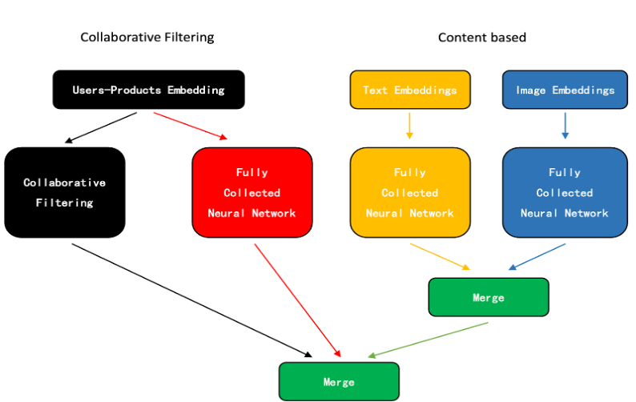

# Deep learning-based Recommender systems Using Amazon Reviews

## Description

Deep learning based Recommender systems Using Amazon Reviews

This project involves using a large dataset containing customer reviews and product information from Amazon to construct a recommender system. The aim is to leverage deep learning techniques to predict consumer preferences based on their consumption habits and product metadata. 

In this project, a hybrid recommendation model is implemented, combining a neural matrix factorization model with content-based models. This hybrid model integrates user-item interactions and item attributes (product image and product review) to predict a user's preference for a particular Amazon fashion product based on past interactions with other products, following the approach proposed by Zhang et al. (2017) for joint representation learning. The neural matrix factorization model's architecture is based on the framework proposed by Chakrabarti and Das (2019). 

## Data Source

[Amazon review data (2018)](https://cseweb.ucsd.edu/~jmcauley/datasets/amazon_v2/)

## Overview of the Context-Aware Hybrid model

## Architecture of a Hybrid model

The hybrid model is used for recommendation systems to predict a user's preference for a particular Amazon fashion product based on past interactions with other products. The model inputs the user, product ID, text, and image. The model consists of four main components. 

## Results and Observation

We employ the Pearson correlation coefficient, RMSE, and MAE to evaluate the hybrid recommendation model's effectiveness.

### Pearson correlation coefficient

Pearson correlation coefficient takes into account the variability of the data. It measures the linear correlation between the predicted and actual ratings. 

After calculating the Pearson correlation coefficient, we obtained a 0.82009 correlation coefficient. It indicated a strong positive correlation between predicted and real ratings.

### RMSE & MAE

RMSE and MAE provide an intuitive measure of the model's performance in predicting user preferences.
RMSE measures the average squared difference between the predicted and actual ratings.
MAE measures the average absolute difference between the predicted and actual ratings. 

After model training and prediction, we obtained that the RMSE is 0.75259 and the MAE is 0.51566. The Test RMSE of 0.75259 and Test MAE of 0.51566 indicate that the hybrid model performs reasonably well in predicting user preferences for items in the test set. 

## Convergence performance

The hybrid model converges at around 10 epochs, which means that the model has learned to make accurate predictions on the training data after approximately five passes through the training set. They indicate that the model is learning quickly and efficiently.

## Full Report
See documentation [here](./Project_report.pdf)

